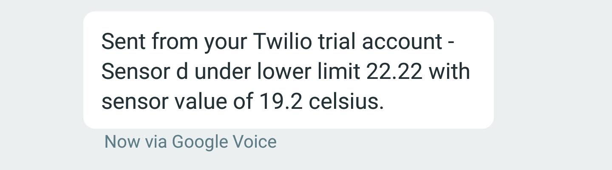

# FSG API

- [Scope of Work](./SOW.md)
- [Dependencies](#d)
- [Instructions for Use](#ifu)
  - [Setup](#su)
  - [Teardown](#td)
- API Reference
  - [Setting Rules](#sr)
    - [Examples](#sre)
  - [Getting Rules](#gr)
    - [Examples](#gre)
  - [Pushing Sensor Data](#psd)
    - [Examples](#psde)

<a name="d"/>
## Dependencies

- Docker daemon installed on local machine
- You have a [Twilio account](https://www.twilio.com/try-twilio)

<a name="ifu"/>
## Instructions for Use

- Clone this repo to your machine
- Copy `flask/constants_example.json` to `flask/constants.json`
- Modify `flask/constants.json` to _your_ values of `account_phone`, `account_sid`,
    `auth_token`, and `tgt_phone` (the phone you want to set text
    messages to when there is an alert).
  - Do not change any values within the `pg` section of `constants.json`
- Move into the root directory of the cloned repository
<a name="su"/>
- Run `docker-compose build --no-cache` to build the images
- Run `docker-compose up` to start the cluster
  - This will spawn two machines:
    - Flask (the endpoint / API)
    - Postgres (the database which the Flask API uses for storage)
- Obtain the IP address of the Flask API by typing `docker inspect --format='{{range .NetworkSettings.Networks}}{{.IPAddress}}{{end}}' fsg_web_1`
    - For me, the value was `172.19.0.3`, yours may differ
    - Note that IP addresses tend to persist upon subsequent
        startup/shutdown sequences
- The endpoints exists on port 80 of the flask server and has the
    following routes:

| Path | Methods | MIME Type | Description |
| --- | --- | --- | --- |
|  /   | POST | JSON | Input data. Raw sensor data is posted here. |
| /setrule | POST | JSON | Where rules (temp limits, units, and logic) are set on a per-sensor basis. |
| /getrule | GET | JSON | Retrieves rule details on a sensor. |

<a name="sr"/>
### Setting Rules

A sensor must have rules set before it can have data posted to it. To set
rules, call the `/setrule` endpoint with the following JSON:

| Parameter | Type | Range | Required? | Default | Description              |
| --------- | ---- | ----- | --------- | ------- | ------------------------ |
| id        | text | 1-255 | y         | n/a     | sensor GUID
| unit      | int  | 0-1   | n         | 0       | temp units (0=Celsius, 1=Fahrenheit) |
| logic     | int  | 0-2   | y         | n/a     | alert logic (0 = alert if below templ, 1 = alert if above temph, 2 = alert if below templ OR above temph) |
| templ     | float | 8B | see desc | n/a | required if logic != 1 |
| temph     | float | 8B | see desc | n/a | required if logic != 0 |

<a name="sre"/>
#### Example

_Note: The below example assumes a flask api IP address of_ `172.19.0.3`:

```python
>>> import requests
>>> res = requests.post('http://172.19.0.3:80/setrule', json={"id":"sensor12345", "unit":1, "logic":0, "temph": 32})
```

If the call is successful, you should show the following response code and
body:

```python
>>> res.status_code
200
```

```python
>>> res.content
b'{"id": "sensor12345", "unit": 1, "logic": 0, "templ": 32.0, "temph": ""}'
```

<a name="gr"/>
### Getting Rules

Assuming _you have already set a rule for a sensor_ using the `/setrule`
route, you may query the database for existing rules. These rules may not
be updated once they have been created.

| Parameter | Type | Range | Required? | Default | Description              |
| --------- | ---- | ----- | --------- | ------- | ------------------------ |
| id        | text | 1-255 | y         | n/a     | sensor GUID you wish to retrieve |

<a name="gre"/>
#### Example

_Note: The below example assumes a flask api IP address of_ `172.19.0.3`:

```python
>>> import requests
>>> res = requests.get('http://172.19.0.3:80/getrule', json={"id": "sensor12345"})
```

If the call is successful, you should show the following response code and body:

```python
>>> res.status_code
200
```

```python
>>> res.content
b'{"logic": 0, "unit": "farenheit", "templ": "32.0", "temph": "None"}
```

<a name="psd"/>
### Pushing Sensor Data

Assuming _you have already set a rule for a sensor_ using the `/setrule`
route, you may push sensor updates to that previously configured sensor `id`
through the updates route, hosted at `/`.

| Parameter | Type | Range | Required? | Default | Description              |
| --------- | ---- | ----- | --------- | ------- | ------------------------ |
| id        | text | 1-255 | y         | n/a     | sensor GUID you wish to post updates to |
| value     | float| 8B    | y         | n/a     | temperature of sensor |
| unit      | int  | 0-1   | n         | 0       | temp units (0=Celsius, 1=Fahrenheit) |

Temperature conversions between rules and input data are conducted
automatically. In other words, a sensor can be created with rules in
Fahrenheit, and updated at the `/` route with units of Celsius. This does not
affect the operation of the utility. Note that the default response unit from
the api is in Celsius for simplicity.

<a name="psde"/>
#### Example

_Note: The below example assumes a flask api IP address of_ `172.19.0.3`:

```python
>>> import requests
>>> res = requests.post('http://172.19.0.3:80', json={"id":"sensor12345", "value": 19, "unit": 1})
```

Note that in the docker daemon logs, you should see debug output similar to the
following:

```
web_1  | compare temps are:  {'logic': 0, 'unit': 1, 'templ': Decimal('32.0'), 'temph': None, 's_value': 19.0, 's_unit': 1, 'id': 'sensor12345'} 0 32.0 None 19.0 1
web_1  | logic0, temp under lower lim
web_1  | SM232XXXXXXXXXXXXXXXXXXXXXXXXXXXXX
```

The last line is the identifier of the text message sent to the mobile phone.
This could be logged in the database with a few code changes if needed. It
could also be caught with a logger on the daemon.

Text messages will be presented to a mobile device similar to the following:

<p align="center">
  
</p>

<a name="td"/>
## Tear Down

To stop the service, run `docker-compose stop && docker-compose rm -f` from the
root directory of the cloned repository.
