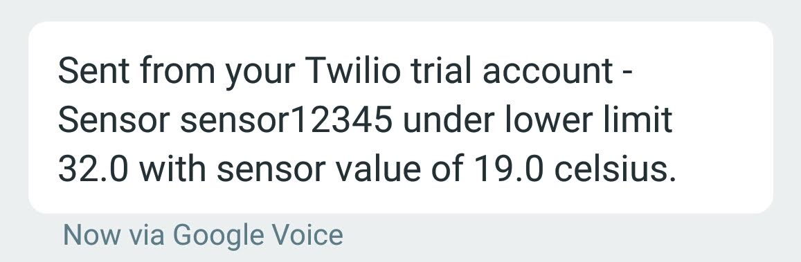

# FSG API

## [Scope of Work](./SOW.md)
## Dependencies

- Docker daemon installed on local machine
- You have a [Twilio account](https://www.twilio.com/try-twilio)

## Instructions for Use

- Clone this repo to your machine
- Copy `flask/constants_example.json` to `flask/constants.json`
- Modify `flask/constants.json` to _your_ values of `account_phone`, `account_sid`,
    `auth_token`, and `tgt_phone` (the phone you want to set text
    messages to when there is an alert).
  - Do not change any values within the `pg` section of `constants.json`
- Move into the root directory of the cloned repository
- Run `docker-compose build --no-cache` to build the images
- Run `docker-compose up` to start the cluster
  - This will spawn two machines:
    - Flask (the endpoint / API)
    - Postgres (the database which the Flask API uses for storage)
- Obtain the IP address of the Flask API by typing `docker inspect --format='{{range .NetworkSettings.Networks}}{{.IPAddress}}{{end}}' fsg_web_1`
    - For me, the value was `172.19.0.3`, yours may differ
    - Note that IP addresses tend to persist upon subsequent
        startup/shutdown sequences
- The endpoints are as follows:

| Path | Methods | MIME Type | Description |
| --- | --- | --- | --- |
|  /   | POST | JSON | Input data. Raw sensor data is posted here. |
| /setrule | POST | JSON | Where rules (temp limits, units, and logic) are set on a per-sensor basis. |
| /getrule | GET | JSON | Retrieves rule details on a sensor. |

### Setting Rules

A sensor must have rules set before it can have data posted to it. To set
rules, call the `/setrule` endpoint with the following JSON:

| Parameter | Type | Range | Required? | Default | Description              |
| --------- | ---- | ----- | --------- | ------- | ------------------------ |
| id        | text | 1-255 | y         | n/a     | sensor GUID
| unit      | int  | 0-1   | n         | 0       | temp units (0=Celsius, 1=Fahrenheit) |
| logic     | int  | 0-2   | y         | n/a     | alert logic (0 = alert if below templ, 1 = alert if above temph, 2 = alert if below templ OR above temph) |
| templ     | float | 8B | see desc | n/a | required if logic != 1 |
| temph     | float | 8B | see desc | n/a | required if logic != 0 |

#### Example

Note: The below example assumes a flask api IP address of `172.19.0.3`.

```python
import requests

res = requests.post('http://172.19.0.3:80/setrule', json={"id":"sensor12345", "unit":1, "logic":0, "temph": 32})
```

If the call is successful, you should show the following response code and
body:

```python
res.status_code

200
```

```python
res.content

b'{"id": "sensor12345", "unit": 1, "logic": 0, "templ": 32.0, "temph": ""}'
```

<p align="center">
  
</p>

- Clone the repo locally
Logic levels:
- logic 0: if temp is lower than templ, message is sent
- logic 1: if temp is higher than temph, message is sent
- logic 2: if temp is lower than templ or higher than temph, message is sent

Units:
- 0: Celsius
- 1: Fahrenheit
